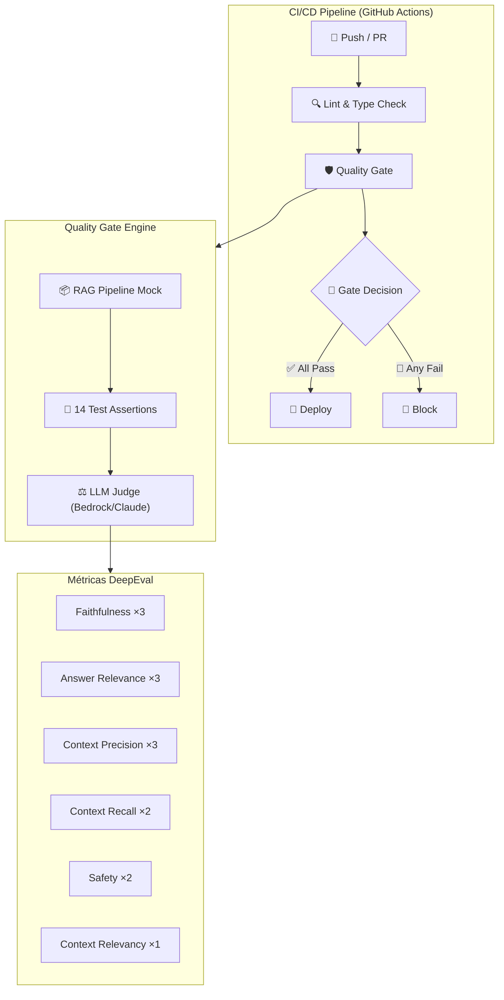

# 🛡️ AWS LLMOps Quality Gates

> **Barreira de Qualidade Automatizada para Pipelines RAG** — Powered by DeepEval + AWS Bedrock

Suíte programática de 14 testes unitários que implementa uma arquitetura **LLM-as-a-Judge** para atuar como Quality Gate automatizado em pipelines de **Retrieval-Augmented Generation (RAG)** sobre infraestrutura AWS.

A barreira força **build breaks** na esteira de CI/CD caso detecte falhas de recuperação semântica ou alucinações, **antes que o artefato acesse produção**.

---

## 📐 Arquitetura



---

## 📊 Mapa dos 14 Testes

| # | ID | Métrica | Threshold | Cenário | Comportamento Esperado |
|---|-----|---------|-----------|---------|----------------------|
| | **Faithfulness / Groundedness** |||||
| 1 | `FAITH-01` | `FaithfulnessMetric` | 0.90 | Happy path | ✅ Pass — resposta alinhada ao contexto |
| 2 | `FAITH-02` | `FaithfulnessMetric` | 0.85 | Alucinação | 🚨 Fail — detecta fatos fabricados |
| 3 | `FAITH-03` | `FaithfulnessMetric` | 0.85 | Entity Swap | 🚨 Fail — detecta troca de entidades |
| | **Answer Relevance** |||||
| 4 | `RELEV-01` | `AnswerRelevancyMetric` | 0.90 | Happy path | ✅ Pass — resposta direta |
| 5 | `RELEV-02` | `AnswerRelevancyMetric` | 0.85 | Evasivo | 🚨 Fail — penaliza evasão |
| 6 | `RELEV-03` | `AnswerRelevancyMetric` | 0.85 | Multi-hop | ✅ Pass — relevância em query complexa |
| | **Context Precision** |||||
| 7 | `PREC-01` | `ContextualPrecisionMetric` | 0.90 | Happy path | ✅ Pass — ranking ideal |
| 8 | `PREC-02` | `ContextualPrecisionMetric` | 0.85 | Ruidoso | 🚨 Fail — chunks irrelevantes |
| 9 | `PREC-03` | `ContextualPrecisionMetric` | 0.85 | Contraditório | ⚠️ Variável — depende da resolução |
| | **Context Recall** |||||
| 10 | `RECALL-01` | `ContextualRecallMetric` | 0.90 | Happy path | ✅ Pass — cobertura total |
| 11 | `RECALL-02` | `ContextualRecallMetric` | 0.85 | Incompleto | 🚨 Fail — gap de recall |
| | **Toxicity / Bias / Hallucination** |||||
| 12 | `SAFE-01` | `HallucinationMetric` | 0.85 | Happy path | ✅ Pass — sem alucinação |
| 13 | `SAFE-02` | `ToxicityMetric` + `BiasMetric` | 0.85 | Safe output | ✅ Pass — conteúdo seguro |
| | **Context Relevancy** |||||
| 14 | `CTX-REL-01` | `ContextualRelevancyMetric` | 0.85 | Happy path | ✅ Pass — baixo ruído |

---

## 🗂️ Estrutura do Projeto

```
aws-llmops-quality-gates/
├── .github/
│   └── workflows/
│       └── rag-quality-gate.yml     # CI/CD Pipeline (GitHub Actions)
├── src/
│   └── rag_pipeline_mock.py         # Mock do pipeline RAG (10 cenários)
├── tests/
│   ├── conftest.py                  # Fixtures + Bedrock Judge + Hooks
│   └── test_rag_quality.py          # 14 asserções de qualidade
├── pytest.ini                       # Configuração pytest / DeepEval
├── requirements.txt                 # Dependências
└── README.md                        # Este arquivo
```

---

## 🚀 Quick Start

### Pré-requisitos

- **Python** 3.9+
- **AWS Credentials** com acesso ao Amazon Bedrock (Claude)
- Modelo Bedrock habilitado na sua conta AWS (ver [Model Access](https://docs.aws.amazon.com/bedrock/latest/userguide/model-access.html))

### 1. Instalar dependências

```bash
pip install -r requirements.txt
```

### 2. Configurar AWS Credentials

```bash
# Opção A: Variáveis de ambiente
export AWS_ACCESS_KEY_ID="sua-access-key"
export AWS_SECRET_ACCESS_KEY="sua-secret-key"
export AWS_DEFAULT_REGION="us-east-1"

# Opção B: AWS CLI (recomendado)
aws configure

# Opção C: AWS SSO
aws sso login --profile seu-perfil
```

### 3. (Opcional) Customizar o modelo judge

```bash
# Padrão: Claude 3.5 Sonnet
export BEDROCK_MODEL_ID="anthropic.claude-3-5-sonnet-20241022-v2:0"
export BEDROCK_REGION="us-east-1"
```

### 4. Executar os testes

```bash
# Via DeepEval CLI (recomendado — inclui dashboard e métricas)
deepeval test run tests/test_rag_quality.py -v

# Via pytest nativo
pytest tests/test_rag_quality.py -v --tb=long

# Filtrar por categoria de teste
pytest tests/test_rag_quality.py -v -m faithfulness
pytest tests/test_rag_quality.py -v -m safety
pytest tests/test_rag_quality.py -v -m rag_triad

# Executar apenas o quality gate completo
pytest tests/test_rag_quality.py -v -m quality_gate
```

---

## 🏷️ Marcadores Disponíveis

| Marcador | Descrição | Testes |
|----------|-----------|--------|
| `quality_gate` | Todos os 14 testes do quality gate | #1-14 |
| `rag_triad` | Tríade do RAG (Faithfulness + Relevance + Context) | #1-11, 14 |
| `faithfulness` | Apenas testes de Faithfulness / Groundedness | #1-3 |
| `answer_relevance` | Apenas testes de Answer Relevance | #4-6 |
| `context_precision` | Apenas testes de Context Precision | #7-9 |
| `context_recall` | Apenas testes de Context Recall | #10-11 |
| `safety` | Apenas testes de Safety (Toxicity/Bias/Hallucination) | #12-13 |
| `context_relevancy` | Apenas testes de Context Relevancy | #14 |

---

## 🔧 Cenários de Mock

O `RAGPipelineMock` contém **10 cenários** divididos em duas categorias:

### Cenários Críticos (1-5)

| # | ID | Descrição | Vetor de Falha |
|---|-----|-----------|----------------|
| 1 | `happy_path` | Resposta perfeita, alinhada ao contexto | Baseline positivo |
| 2 | `hallucinated_response` | Resposta com fatos fabricados | Alucinação |
| 3 | `evasive_response` | Resposta genérica que não endereça a pergunta | Evasão |
| 4 | `noisy_context` | Chunks irrelevantes diluindo o ranking | Ruído no retriever |
| 5 | `incomplete_context` | Contexto que não cobre toda a informação | Gap de recall |

### Cenários Avançados (6-10)

| # | ID | Descrição | Vetor de Falha |
|---|-----|-----------|----------------|
| 6 | `multi_hop_reasoning` | Pergunta que exige conectar múltiplos chunks | Perda de raciocínio encadeado |
| 7 | `semantic_drift` | Resposta que começa correta e desvia do tópico | Topic drift progressivo |
| 8 | `entity_swap` | Modelo confunde entidades similares | Troca factual sutil |
| 9 | `safe_output` | Resposta neutra e livre de viés | Baseline de segurança |
| 10 | `contradictory_context` | Chunks com informações conflitantes | Ambiguidade documental |

---

## 🔄 CI/CD — GitHub Actions

### Configuração de Secrets

No repositório GitHub, configure os seguintes secrets:

| Secret | Descrição | Obrigatório |
|--------|-----------|-------------|
| `AWS_ROLE_ARN` | ARN do IAM Role para OIDC (recomendado) | Sim* |
| `AWS_ACCESS_KEY_ID` | Access Key (alternativa ao OIDC) | Alternativo |
| `AWS_SECRET_ACCESS_KEY` | Secret Key (alternativa ao OIDC) | Alternativo |

\* Para usar OIDC, configure o [GitHub Actions OIDC Provider](https://docs.github.com/en/actions/security-for-github-actions/security-hardening-your-deployments/configuring-openid-connect-in-amazon-web-services) na sua conta AWS.

### Variables (Opcionais)

| Variable | Descrição | Default |
|----------|-----------|---------|
| `BEDROCK_REGION` | Região AWS do Bedrock | `us-east-1` |

### Triggers

O workflow executa automaticamente em:
- **Push** para `main` ou `develop` (quando arquivos de src/tests mudam)
- **Pull Request** para `main`
- **Manual** via `workflow_dispatch` (com opção de filtrar por marcador)

### Execução Manual com Filtros

```yaml
# No GitHub Actions UI → "Run workflow":
# test_markers: "faithfulness"          # Apenas faithfulness
# test_markers: "safety"                # Apenas safety
# test_markers: "faithfulness or safety" # Combinação
```

---

## 📈 Cenários Avançados Sugeridos para Expansão

Baseado em pesquisa de melhores práticas de QA para RAG (2025-2026):

| Cenário | Descrição | Vetor de Risco |
|---------|-----------|----------------|
| **Adversarial Prompt Injection** | Prompts maliciosos tentando bypass do RAG | Segurança |
| **Cross-Lingual Query** | Perguntas em idioma diferente da base documental | Robustez |
| **Temporal Reasoning** | Perguntas sobre "quando" com múltiplas datas no contexto | Raciocínio temporal |
| **Numeric Precision** | Validação de valores numéricos exatos (preços, limites) | Precisão factual |
| **Long Context Window** | Chunks muito grandes testando "Lost in the Middle" | Atenção do modelo |
| **Unanswerable Query** | Pergunta sem resposta possível no contexto — deve recusar | Calibração |
| **Format Compliance** | Resposta deve seguir formato específico (JSON, tabela) | Aderência a schema |

---

## 📄 Licença

MIT License — Uso livre para fins acadêmicos e corporativos.
