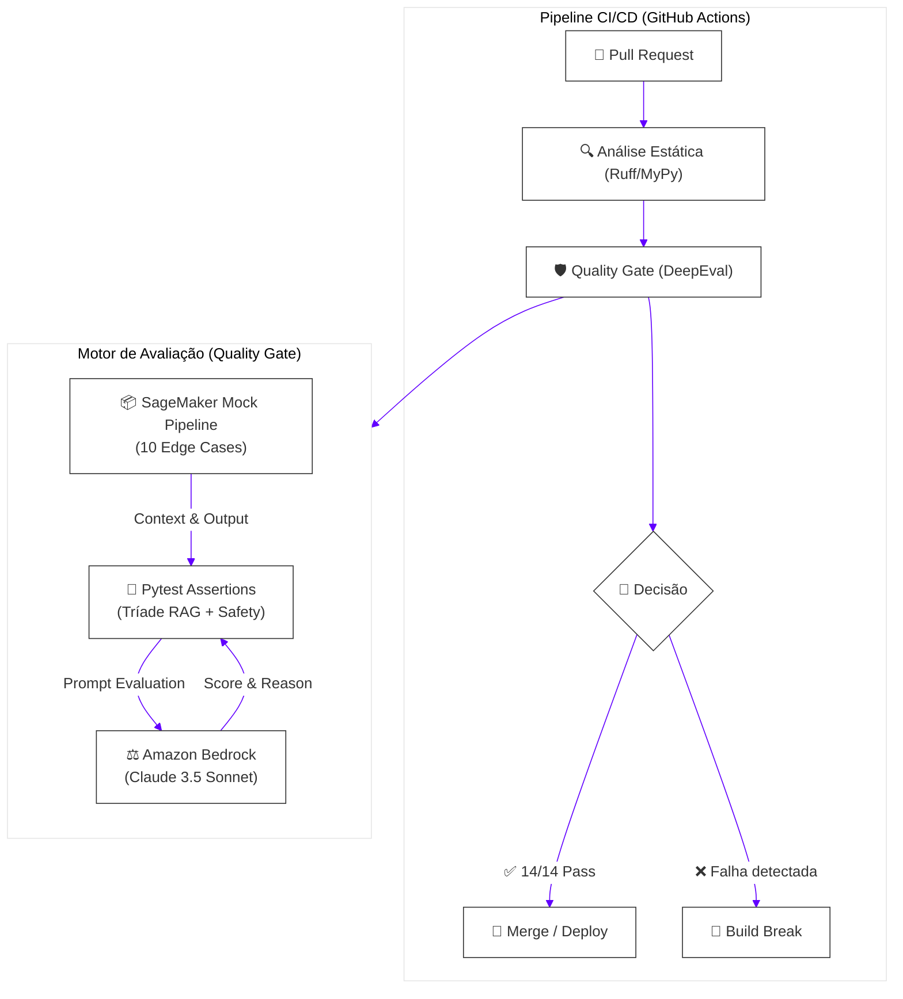

<div align="center">
  
  <h1>🛡️ AWS LLMOps Quality Gates</h1>
  <p><strong>Barreira de Qualidade Automatizada para Pipelines RAG (Retrieval-Augmented Generation)</strong></p>

  [](https://www.python.org/downloads/)
  [](https://docs.confident-ai.com/)
  [](https://docs.pytest.org/)
  [](https://aws.amazon.com/bedrock/)
  [](https://github.com/features/actions)
</div>

<br>

> Uma suíte programática de testes unitários que implementa uma arquitetura **LLM-as-a-Judge** utilizando Amazon Bedrock (Claude) para atuar como um **Quality Gate** estrito. Esta esteira previne regressões de qualidade, forçando *build breaks* automatizados caso detecte alucinações, evasões ou falhas de recuperação semântica antes que os artefatos alcancem o ambiente de produção.

---

## 📑 Índice

- [✨ Principais Recursos](#-principais-recursos)
- [📐 Arquitetura da Solução](#-arquitetura-da-solução)
- [🗺️ Matriz de Cobertura de Testes](#-matriz-de-cobertura-de-testes)
- [📦 Estrutura do Repositório](#-estrutura-do-repositório)
- [🚀 Guia de Instalação Rápida](#-guia-de-instalação-rápida)
- [🔄 Integração CI/CD](#-integração-cicd)
- [🔬 Engenharia de Testes TDD](#-engenharia-de-testes-tdd)
- [📚 Próximos Passos](#-próximos-passos)

---

## ✨ Principais Recursos

- **Validação em Nível de Produção:** Abandone os `vibe checks`. Execute avaliações determinísticas em CI/CD baseadas na "Tríade do RAG" (*Contextual Precision*, *Faithfulness* e *Answer Relevancy*).
- **Amazon Bedrock Integrado:** Utiliza LLMs *state-of-the-art* da AWS (como o Anthropic Claude 3.5 Sonnet) como juízes implacáveis, mantendo a privacidade e segurança dos dados sob a governança da sua conta AWS.
- **10 Cenários Comportamentais RAG Simulados:** Desde *happy paths* até casos de borda (*edge cases*) avançados (como *Semantic Drift* e *Entity Swaps*), simulando falhas reais que podem ocorrer em endpoints do AWS SageMaker.
- **Integração Nativa com Pytest:** A suíte suporta recursos nativos do ecossistema `pytest` (marcadores personalizados, execução paralela e geração de relatórios de falhas extraídos programaticamente).
- **Segurança e Alinhamento (Safety Gates):** Filtros binários que vetam imediatamente comportamentos inadequados, como toxicidade e viés cognitivo/comportamental.

---

## 📐 Arquitetura da Solução



---

## 🗺️ Matriz de Cobertura de Testes

Foram implementados 14 testes estritos, projetados para garantir os pilares da qualidade generativa.

> [!IMPORTANT]
> **Thresholds (Limiares)**: Os limites estão configurados de forma agressiva (0.85 — 0.90) para o padrão *enterprise*. Ajuste-os caso a taxa de falsos positivos bloqueie excessivamente a esteira em fases iniciais de desenvolvimento.

### 📌 Tríade do RAG
| Categoria | ID | Métrica (DeepEval) | 🎯 Objetivo | Limiar |
|-----------|----|--------------------|-------------|:---:|
| **Faithfulness** | `FAITH-01` a `03` | `FaithfulnessMetric` | Valida ancoragem factual. Pune fatos alucinados e a troca de entidades. | `>= 0.85` |
| **Answer Relevance** | `RELEV-01` a `03` | `AnswerRelevancyMetric` | Penaliza respostas evasivas, genéricas ou fora de tópico. | `>= 0.85` |
| **Context Precision**| `PREC-01` a `03` | `ContextualPrecisionMetric` | Avalia o ranqueamento dos documentos no *Vector Database*. A presença de ruído dilui a pontuação. | `>= 0.85` |

### 📌 Métricas Complementares
| Categoria | ID | Métrica (DeepEval) | 🎯 Objetivo | Limiar |
|-----------|----|--------------------|-------------|:---:|
| **Context Recall** | `RECALL-01` a `02` | `ContextualRecallMetric` | O recuperador trouxe toda a base necessária? Detecta gaps informacionais. | `>= 0.85` |
| **Safety / Viés** | `SAFE-01` a `02` | `ToxicityMetric` / `BiasMetric` | Análise binária (Pass/Fail) para segurança corporativa. | `>= 0.85` |
| **Context Relevancy**| `CTX-REL-01` | `ContextualRelevancyMetric` | Densidade informacional. Penaliza chunks desnecessariamente massivos. | `>= 0.85` |

---

## 📦 Estrutura do Repositório

```text
aws-llmops-quality-gates/
├── .github/workflows/
│   └── rag-quality-gate.yml    # Pipeline GitHub Actions com suporte a OIDC e Bedrock
├── src/
│   └── rag_pipeline_mock.py    # Wrapper simulando respostas e falhas do SageMaker
├── tests/
│   ├── conftest.py             # Fixtures Pytest, inicialização do Amazon Bedrock e logs
│   └── test_rag_quality.py     # As 14 Asserções de Qualidade
├── pytest.ini                  # Configurações de marcadores e caminhos
├── requirements.txt            # Dependências com Lock
└── README.md                   # Documentação do projeto
```

---

## 🚀 Guia de Instalação Rápida

### 1. Pré-requisitos do Ambiente

- **Python**: Versão `3.9` ou superior.
- **AWS Account**: Acesso programático configurado.
- **Model Access**: Verifique se a sua conta possui acesso habilitado aos modelos no [Amazon Bedrock Console](https://docs.aws.amazon.com/bedrock/latest/userguide/model-access.html).

### 2. Instalação Básica

```bash
# Clone o repositório e crie o ambiente virtual
python -m venv .venv
source .venv/bin/activate  # Ou .venv\Scripts\activate no Windows

# Instale as dependências do projeto
pip install -r requirements.txt
```

### 3. Autenticação AWS

Os testes utilizam o SDK `boto3` para realizar as chamadas ao Amazon Bedrock. Configure suas credenciais da AWS utilizando uma das abordagens a seguir:

**No Linux/macOS (Bash):**
```bash
# Opção recomendada (SSO/IAM Identity Center):
aws configure sso --profile seu-perfil-sso
export AWS_PROFILE=seu-perfil-sso

# Opção estática:
export AWS_ACCESS_KEY_ID="sua_chave"
export AWS_SECRET_ACCESS_KEY="seu_segredo"
export AWS_DEFAULT_REGION="us-east-1"
```

**No Windows (PowerShell):**
```powershell
# Opção recomendada (SSO/IAM Identity Center):
aws configure sso --profile seu-perfil-sso
$env:AWS_PROFILE="seu-perfil-sso"

# Opção estática:
$env:AWS_ACCESS_KEY_ID="sua_chave"
$env:AWS_SECRET_ACCESS_KEY="seu_segredo"
$env:AWS_DEFAULT_REGION="us-east-1"
```

### 4. Executando o Quality Gate

Você pode executar utilizando a CLI nativa do DeepEval (recomendado, pois gera logs consolidados), ou pelo `pytest` tradicional:

```bash
# Executa todos os testes e exibe os motivos (.reason) no final
deepeval test run tests/test_rag_quality.py -v

# Ou utilize filtros por tags (marcadores definidos no pytest.ini)
pytest tests/test_rag_quality.py -m "faithfulness" -v
pytest tests/test_rag_quality.py -m "safety" -v
pytest tests/test_rag_quality.py -m "rag_triad" -v
```

> [!TIP]
> Por padrão, o framework utiliza o modelo `anthropic.claude-3-5-sonnet-20241022-v2:0`. Para alterar o modelo juiz, configure a variável de ambiente `BEDROCK_MODEL_ID`:
> - No Linux/macOS: `export BEDROCK_MODEL_ID="anthropic.claude-3-haiku-20240307-v1:0"`
> - No Windows (PowerShell): `$env:BEDROCK_MODEL_ID="anthropic.claude-3-haiku-20240307-v1:0"`

---

## 🔄 Integração CI/CD

O repositório já inclui um arquivo `.github/workflows/rag-quality-gate.yml` altamente parametrizado.

### Configuração de Segredos e Variáveis no GitHub:

Para viabilizar a execução automática no GitHub Actions, configure as credenciais de acesso à AWS em **Settings > Secrets and variables > Actions** utilizando uma das seguintes abordagens:

**Abordagem 1: Provedor de Identidade OIDC (Recomendada/Segura)**
- `AWS_ROLE_ARN`: O ARN da Role IAM configurada para estabelecer relação de confiança com o GitHub OIDC.

**Abordagem 2: Credenciais Estáticas do IAM (Alternativa)**
- `AWS_ACCESS_KEY_ID`: A Access Key da sua conta de serviço IAM.
- `AWS_SECRET_ACCESS_KEY`: A Secret Key correspondente.

### Comentário Automatizado no Pull Request

Sempre que a pipeline roda em um PR, o código extrai falhas com o método `metric.reason` nativo do DeepEval e as relata na Interface do GitHub.

<details>
<summary>👀 Ver Exemplo do Report de Falha</summary>

```text
╔══════════════════════════════════════════════════════════╗
║       QUALITY GATE FAILURE — RAG ASSERTION BROKE         ║
╠══════════════════════════════════════════════════════════╣
║ Test: test_faithfulness_rejects_hallucinated_facts       ║
╠══════════════════════════════════════════════════════════╣
║ Reason:                                                  ║
║ A resposta do LLM inclui informações de promoções (Desconto de 90%)
║ e isenções garantidas ("preço até 2030") que não possuem 
║ lastro documental nos chunks originais recuperados.     ║
╚══════════════════════════════════════════════════════════╝
```

</details>

---

## 🔬 Engenharia de Testes TDD

### Como os Edge Cases são Testados?

Para garantir que o Quality Gate não é frágil, construímos um arquivo `src/rag_pipeline_mock.py` que emula os retornos de um *Endpoint Real-Time* do SageMaker. Nele, existem **testes negativos programados**.

Isso significa que desenhamos dados defeituosos e forçamos os limites do Avaliador.

**Exemplo de Cenários Simulados:**
- `semantic_drift`: O LLM inicia a resposta correta, mas "deriva" para tópicos aleatórios de AWS Cloud após as primeiras frases.
- `entity_swap`: A resposta confunde *SageMaker Pipelines* com *Step Functions*, produzindo uma saída bem formatada, porém incorreta sob o contexto fático.
- `contradictory_context`: Simulamos a entrega de dois chunks conflitantes pelo Retriever (um dizendo timeout de 3600s e o outro 7200s).

---

## 📚 Próximos Passos

Esta arquitetura serve como a base fundacional do projeto `huggingface-sagemaker-workshop-series`. Conforme a aplicação RAG escalar, recomenda-se:

1. **Adversarial Prompt Injection:** Inserir métricas do DeepEval focadas em injeção de prompt quebrando a *system message*.
2. **Avaliações em Lote Diárias:** Agendar o Workflow (CRON) para avaliar o modelo recém-treinado no S3 contra um "Golden Dataset" de 100 perguntas antes que os MLOps Engineers façam deploy para STG.
3. **Observabilidade (Confident AI / Phoenix):** Exportar os traces e scores do Bedrock para uma interface de Telemetria centralizada.
